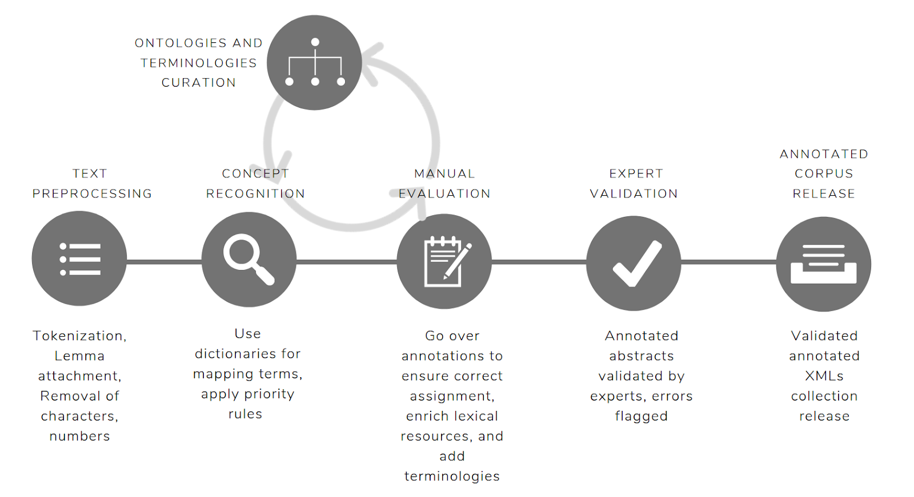
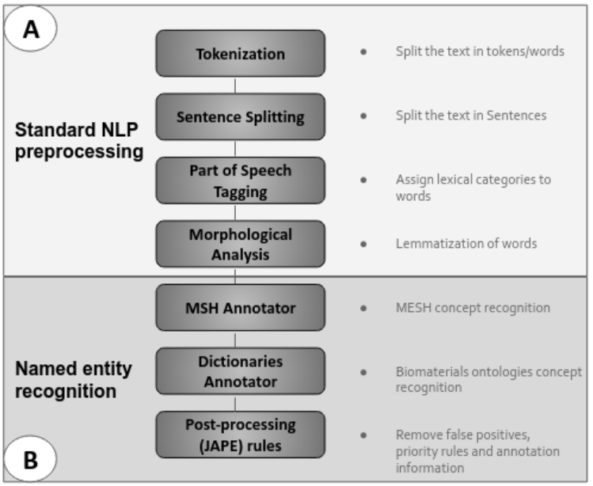

# Biomaterials annotator
The Biomaterials Annotator: a system for ontology-based concept annotation of biomaterials text.

The Biomaterials Annotator is an ontology-based NER system that identifies biomaterial specific types of concepts. It provides a schema for combining terms from mutiple ontologies and nomenclutures that are listed below. A full list of type of concepts annotated are available [here](Data_model.csv). 

The Biomaterials Annotator has been implemented following a modular organization using software containers for the different components and orchestrated  using  Nextflow  as  workflow  manager. Natural language processing (NLP) components  are  mainly  developed  in Java; and  it  uses  the Stanford CoreNLP Natural Language Processing open  source  toolkit. 

## Annotated corpus
An biomaterial annotated gold standard corpus of 1222 MEDLINE abstract, describing the evaluation of of biomaterials in either a laboratory or clinical setting, resulting from the execution of the Biomaterials Annotator is available and free to use at https://github.com/ProjectDebbie/Biomaterials_annotated_corpus.
Each abstract is individually contained as a separate file under the GATE format.

## Biomaterials Annotator Project Overview

## System architecture

## Ontologies used for the annotations
1. [MESH (UMLS)](https://bioportal.bioontology.org/ontologies/MESH)
2. [DEB](https://bioportal.bioontology.org/ontologies/DEB)
3. [GMDN](https://www.gmdnagency.org/)
4. [CHEBI](https://bioportal.bioontology.org/ontologies/CHEBI)
5. [IOBC](https://bioportal.bioontology.org/ontologies/IOBC)
6. [NCIT](https://bioportal.bioontology.org/ontologies/NCIT)
7. [NPO](https://bioportal.bioontology.org/ontologies/NPO)
8. [OBI](https://bioportal.bioontology.org/ontologies/OBI)
9. [ONTOTOXNUC](https://bioportal.bioontology.org/ontologies/ONTOTOXNUC)
10. [UBERON](https://bioportal.bioontology.org/ontologies/UBERON)
11. [PREMEDONTO](https://bioportal.bioontology.org/ontologies/PREMEDONTO)
12. [EDAM Bioimaging Ontology](https://bioportal.bioontology.org/ontologies/EDAM-BIOIMAGING)
13. [CHMO](https://bioportal.bioontology.org/ontologies/CHMO)

The MSH Annotator, annotates relevant categories from the MeSH terminology; the Dictionary Annotator, annotates the rest of predefined categories from the relevant dictionaries; and the Post-processing step in which specific rules were executed. These include entity recognition based on lexical rules and the removal of false positives, abbreviations concept recognitions and detection of concept using lexical rules, among other tasks. 

The MSH Annotator is available at https://github.com/ProjectDebbie/debbie_umls_annotations; and the Dictionary Annotator and Post-processing rules are available at https://github.com/ProjectDebbie/DEBBIE_dictionaries_annotations. 

##Run the Biomaterials Annotator 

You need to have docker and nextflow installed, then configure the run.sh file.

## Actual Version: 1.0, 2021-03-23
## [Changelog](https://github.com/ProjectDebbie/Biomaterials_annotator/blob/master/CHANGELOG)

## Versioning

We use [SemVer](http://semver.org/) for versioning. For the versions available, see the [tags on this repository](https://github.com/ProjectDebbie/Biomaterials_annotator/tags).

## Authors

**Javi Corvi and Osnat Hakimi**

## To cite the Biomaterials Annotator
Add publication

## License

This project is licensed under the GNU License - see the [LICENSE](LICENSE) file for details

## Funding

 This project has received funding from the European Union’s Horizon 2020 research and innovation programme under the Marie Sklodowska-Curie grant agreement No 751277
